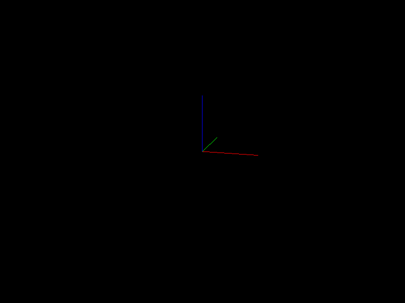

# EGL-in-Docker: A Minimal Docker Example for Hardware-Accelerated EGL Offline Render

The title says it all. *Necessary* additional environment variable and volume mount options like `DISPLAY` and `/usr/lib/wsl` are included in the example command. Please refer to the `Dockerfile`, `entrypoint.sh`, and the `docker run` commands documented below to get ideas on using this repo for your own purpose.

# TODOs

- [x] Initial commit with fully replicable code example for WSL
- [ ] Linux example
- [ ] Upload image on Docker Hub

# Usage

```properties
docker build -t [YOUR TAG] .
```

Run the following `docker run` commands depending on your operating system.
`python code/render.py` can be replaced with `bash` to make it an interactive session instead.

## On WSL2

All of the options are more or less required for making the vispy example work.

```properties
docker run -it --rm --gpus all --mount type=bind,source=.,target=/code --net=host \
--env DISPLAY=$DISPLAY \
--env LD_LIBRARY_PATH=/usr/lib/wsl/lib \
-v /tmp/.X11-unix:/tmp/.X11-unix:ro \
-v /usr/lib/wsl:/usr/lib/wsl \
[YOUR TAG] python code/render.py
```

This should generate `out.png`, which looks like this:



## On Linux

TODO

## Hardware Acceleration Validation (On WSL2)

With `DISPLAY` and `/tmp/.X11-unix` inherited from WSL2, you can first run the container with `bash` instead of `python code/render.py` and run:

```properties
apt install -y mesa-utils && glxinfo -B
```

On my system, I get the following (your milege may vary):
```
name of display: :0                                                                                                                                                                                                                                                                                                                                                          display: :0  screen: 0                                                                                                                                                                                                                                                                                                                                                       direct rendering: Yes                                                                                                                                                                                                                                                                                                                                                        Extended renderer info (GLX_MESA_query_renderer):                                                                                                                                                                                                                                                                                                                                Vendor: Microsoft Corporation (0xffffffff)                                                                                                                                                                                                                                                                                                                                   Device: D3D12 (NVIDIA GeForce RTX 3070 Ti) (0xffffffff)                                                                                                                                                                                                                                                                                                                      Version: 22.2.5                                                                                                                                                                                                                                                                                                                                                              Accelerated: yes                                                                                                                                                                                                                                                                                                                                                             Video memory: 73430MB                                                                                                                                                                                                                                                                                                                                                        Unified memory: no                                                                                                                                                                                                                                                                                                                                                           Preferred profile: core (0x1)                                                                                                                                                                                                                                                                                                                                                Max core profile version: 4.2                                                                                                                                                                                                                                                                                                                                                Max compat profile version: 4.2                                                                                                                                                                                                                                                                                                                                              Max GLES1 profile version: 1.1                                                                                                                                                                                                                                                                                                                                               Max GLES[23] profile version: 3.1                                                                                                                                                                                                                                                                                                                                        OpenGL vendor string: Microsoft Corporation                                                                                                                                                                                                                                                                                                                                  OpenGL renderer string: D3D12 (NVIDIA GeForce RTX 3070 Ti)                                                                                                                                                                                                                                                                                                                   OpenGL core profile version string: 4.2 (Core Profile) Mesa 22.2.5                                                                                                                                                                                                                                                                                                           OpenGL core profile shading language version string: 4.20                                                                                                                                                                                                                                                                                                                    OpenGL core profile context flags: (none)                                                                                                                                                                                                                                                                                                                                    OpenGL core profile profile mask: core profile                                                                                                                                                                                                                                                                                                                                                                                                                                                                                                                                                                                                                                                                                                            OpenGL version string: 4.2 (Compatibility Profile) Mesa 22.2.5                                                                                                                                                                                                                                                                                                               OpenGL shading language version string: 4.20                                                                                                                                                                                                                                                                                                                                 OpenGL context flags: (none)                                                                                                                                                                                                                                                                                                                                                 OpenGL profile mask: compatibility profile                                                                                                                                                                                                                                                                                                                                                                                                                                                                                                                                                                                                                                                                                                                OpenGL ES profile version string: OpenGL ES 3.1 Mesa 22.2.5                                                                                                                                                                                                                                                                                                                  OpenGL ES profile shading language version string: OpenGL ES GLSL ES 3.10
```
